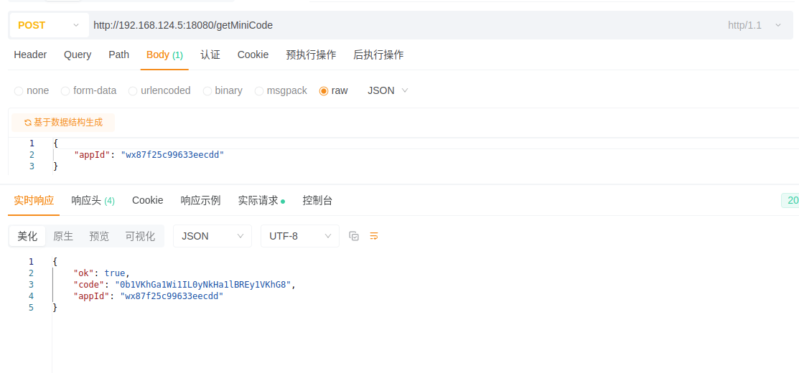
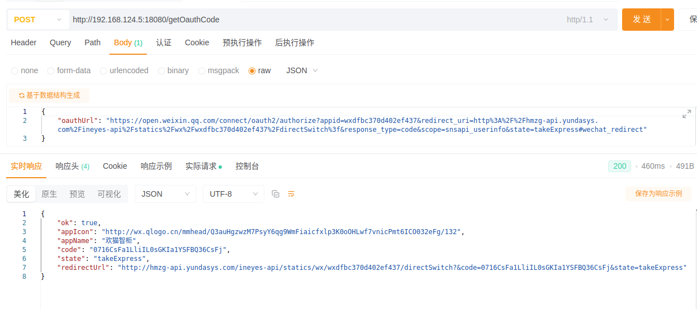
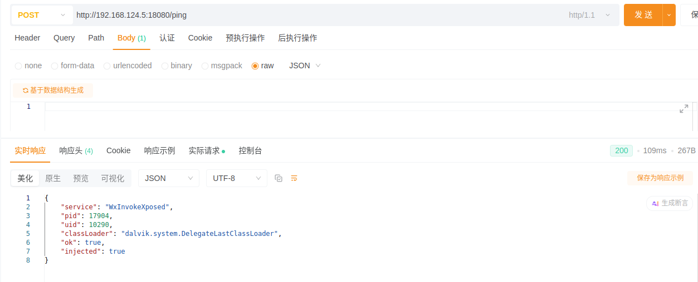

# WxInvokeHelper

> 基于 **Xposed / LSPosed** 的微信登录链路调试模块。
> 用于在**授权测试环境**下，主动调用已登录客户端内部能力，获取小程序登录 `code` 或 OAuth `redirectUrl`，辅助自研 App / 小程序完成登录联调。

---

## 项目作用

`WxInvokeXposed` 注入到某信主进程后，对外提供本地调用接口：

- 获取小程序登录 `code`
- 获取 OAuth 授权后的 `redirectUrl`
- 解析 `code / state`
- 便于自研后端换取业务 Token
- 支持 HTTP API / Broadcast 调用

> 注意：模块不破解 Token，不绕过业务鉴权。Token 仍由自有服务端按正常流程签发。

---

## 效果展示

### 小程序 Code 获取



通过主动调用小程序登录能力，获取一次性登录 `code`，再交给自有服务端换取业务 Token。

---

### OAuth 微信网页登录



通过 OAuth 授权链路获取 `redirectUrl`，后续跟随业务重定向，完成自研 App 登录态获取。

---

### 检查模块是否注入成功


## 支持能力

| 能力 | 说明 |
|---|---|
| `/getMiniCode` | 获取小程序登录 `code` |
| `/getOauthCode` | 获取 OAuth `redirectUrl / code / state` |
| `/ping` | 检查模块是否注入成功 |
| Broadcast | 支持同机 App 或 adb 调用 |
| 版本适配 | 混淆类名集中维护，便于升级 |

---

## 使用环境

- Android Root 设备
- LSPosed / EdXposed
- 目标 App 已登录
- 已授权测试账号
- adb / curl / Postman / Apifox

测试版本：

```text
微信 8.0.71
```

> 不同版本混淆名可能变化，需要重新适配。

---

## 快速开始

1. 安装XPosed模块 APK
2. 在 LSPosed 中启用模块
3. 作用域选择目标 App
4. 强制停止并重新打开目标 App
5. 调用 `/ping` 校验注入状态

```bash
curl -X POST http://127.0.0.1:18080/ping \
  -H "Content-Type: application/json" \
  -d '{}'
```

---

## API 示例

### 获取小程序 Code

```bash
curl -X POST http://127.0.0.1:18080/getMiniCode \
  -H "Content-Type: application/json" \
  -d '{
    "appId": "wx**************",
    "versionType": 0,
    "extScene": 0
  }'
```

返回示例：

```json
{
  "ok": true,
  "appId": "wx**************",
  "code": "081**************"
}
```

---

### 获取 OAuth RedirectUrl

```bash
curl -X POST http://127.0.0.1:18080/getOauthCode \
  -H "Content-Type: application/json" \
  -d '{
    "oauthUrl": "https://open.xxx.com/connect/oauth2/authorize?...",
    "scene": 4,
    "autoOauth": 1,
    "timeoutMs": 15000
  }'
```

返回示例：

```json
{
  "ok": true,
  "redirectUrl": "https://example.com/callback?code=071****&state=test",
  "code": "071****",
  "state": "test"
}
```

---

## 适用场景

- 小程序登录链路调试
- 自研 App 授权登录联调
- Android 逆向学习
- Xposed 模块工程化实践
- Frida 脚本迁移 Xposed
- 企业内部自动化测试

---

## 不适用场景

本项目禁止用于：

- 未授权获取第三方账号登录态
- 批量采集用户 Token
- 绕过平台风控
- 黑灰产、薅羊毛、撞库等非法用途

请勿在 Issue 中提交真实 `appId / code / token / cookie`。

---

## 技术付费咨询

可提供以下服务：

- Xposed / LSPosed 模块开发
- Frida 脚本迁移 Xposed
- 微信版本混淆名适配
- 小程序登录链路分析
- 安卓app逆向分析

如需技术支持或定制开发，请联系：


```text
公众号：码上有银纸
微信：__int64
qq：1415662711
备注：技术咨询
```

---

## 免责声明

本项目仅供安全研究、逆向学习、自有业务调试和授权测试使用。
使用者需自行承担因不当使用造成的法律风险。
作者不对任何未授权使用行为负责。